# 提示词收藏夹 - 完整解决方案

一个现代化的提示词管理和收藏系统，包含用户前端和管理后台。

> 📸 **查看应用截图**: 跳转到 [应用截图](#-应用截图) 部分查看完整的界面展示

## 📋 目录

- [项目结构](#项目结构)
- [功能特性](#功能特性)
- [快速开始](#快速开始)
- [开发指南](#开发指南)
- [API 接口](#api-接口)
- [部署指南](#部署指南)
- [自定义配置](#自定义配置)
- [应用截图](#-应用截图)
- [贡献指南](#贡献指南)
- [许可证](#许可证)
- [支持](#支持)
- [更新日志](#-更新日志)

## 项目结构

```
word_collect/
├── server/          # Express 后端服务
├── client/          # Vue 用户前端
├── admin/           # Vue 管理后台
└── package.json     # 根项目配置
```

## 功能特性

### 用户前端 (client/)
- 🎨 现代化 UI 设计，基于 Tailwind CSS
- 📝 提示词的创建、编辑、删除和管理
- 🏷️ 分类管理和标签系统
- 🔍 强大的搜索和筛选功能
- ❤️ 收藏功能
- 📊 使用统计
- 📱 响应式设计，支持移动端

### 管理后台 (admin/)
- 👨‍💼 完整的管理员界面
- 📊 数据统计仪表板
- 👥 用户管理（增删改查、批量操作）
- 📝 提示词完整管理（创建、编辑、删除、批量操作）
- 🏷️ 分类管理（完整CRUD操作）
- 📋 操作日志查看和导出
- 📤 数据导出功能（支持JSON格式）
- ⚙️ 系统设置配置
- 🔒 安全认证和权限控制

### 后端服务 (server/)
- 🚀 Express.js RESTful API
- 📁 基于文件的数据存储
- 🔐 管理员认证
- 📊 统计数据API
- 🛡️ CORS 支持

## 快速开始

### 1. 安装依赖

```bash
# 安装所有项目的依赖
npm run install:all
```

### 2. 启动开发环境

#### 启动用户前端和后端
```bash
npm run dev
```

#### 启动所有服务（包括管理后台）
```bash
npm run dev:all
```

### 3. 访问应用

- **用户前端**: http://localhost:3000
- **管理后台**: http://localhost:3001
- **后端API**: http://localhost:3002

### 4. 管理员登录

管理后台默认账号：
- 用户名: `admin`
- 密码: `admin123`

## 开发指南

### 项目技术栈

#### 前端
- **Vue 3** - 渐进式 JavaScript 框架
- **Vue Router** - 官方路由管理器
- **Pinia** - 状态管理
- **Tailwind CSS** - 实用优先的 CSS 框架
- **Headless UI** - 无样式的可访问组件
- **Heroicons** - 精美的 SVG 图标
- **Vite** - 快速的构建工具

#### 后端
- **Express.js** - Web 应用框架
- **fs-extra** - 文件系统操作
- **uuid** - 唯一标识符生成
- **cors** - 跨域资源共享

### 目录结构详解

```
server/
├── index.js         # 主服务器文件
├── data/           # 数据存储目录
│   ├── prompts.json    # 提示词数据
│   └── categories.json # 分类数据
└── package.json    # 服务器依赖

client/
├── src/
│   ├── components/     # 可复用组件
│   ├── views/         # 页面组件
│   ├── stores/        # Pinia 状态管理
│   ├── services/      # API 服务
│   └── router/        # 路由配置
├── public/            # 静态资源
└── package.json       # 前端依赖

admin/
├── src/
│   ├── components/     # 管理后台组件
│   ├── views/         # 管理页面
│   ├── stores/        # 状态管理
│   └── services/      # API 服务
└── package.json       # 后台依赖
```

### API 接口

#### 提示词相关
- `GET /api/prompts` - 获取提示词列表
- `POST /api/prompts` - 创建提示词
- `PUT /api/prompts/:id` - 更新提示词
- `DELETE /api/prompts/:id` - 删除提示词
- `POST /api/prompts/:id/use` - 增加使用次数

#### 分类相关
- `GET /api/categories` - 获取分类列表
- `POST /api/categories` - 创建分类
- `PUT /api/categories/:id` - 更新分类
- `DELETE /api/categories/:id` - 删除分类

#### 管理员相关
- `POST /api/admin/login` - 管理员登录
- `POST /api/admin/logout` - 管理员登出
- `GET /api/admin/stats` - 获取统计数据
- `POST /api/admin/prompts/batch-delete` - 批量删除提示词
- `GET /api/admin/export/:type` - 数据导出（支持prompts、categories、all）

## 部署指南

### 1. 构建生产版本

```bash
# 构建用户前端
npm run client:build

# 构建管理后台
npm run admin:build
```

### 2. 启动生产服务器

```bash
npm run server:start
```

### 3. 环境变量配置

创建 `.env` 文件：

```env
PORT=3002
NODE_ENV=production
```

## 自定义配置

### 修改端口

- 服务器端口：修改 `server/index.js` 中的 `PORT` 变量
- 前端端口：修改 `client/vite.config.js` 中的 `server.port`
- 后台端口：修改 `admin/vite.config.js` 中的 `server.port`

### 添加新功能

1. **添加新的API接口**：在 `server/index.js` 中添加路由
2. **添加新页面**：在对应的 `src/views/` 目录中创建组件
3. **添加新组件**：在 `src/components/` 目录中创建可复用组件

## 贡献指南

1. Fork 项目
2. 创建功能分支 (`git checkout -b feature/AmazingFeature`)
3. 提交更改 (`git commit -m 'Add some AmazingFeature'`)
4. 推送到分支 (`git push origin feature/AmazingFeature`)
5. 打开 Pull Request

## 许可证

本项目采用 MIT 许可证 - 查看 [LICENSE](LICENSE) 文件了解详情。

## 📸 应用截图

### 用户前端界面

#### 主界面
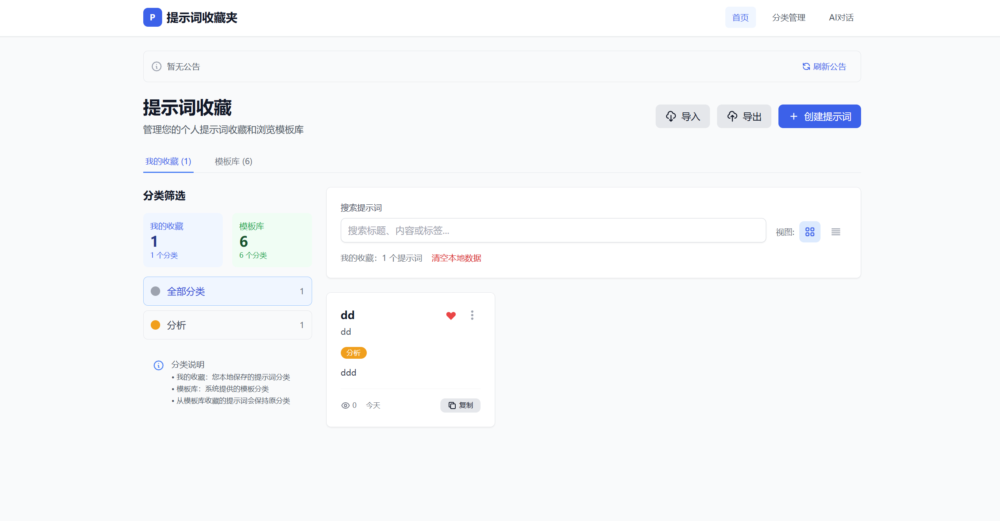

#### 分类页面
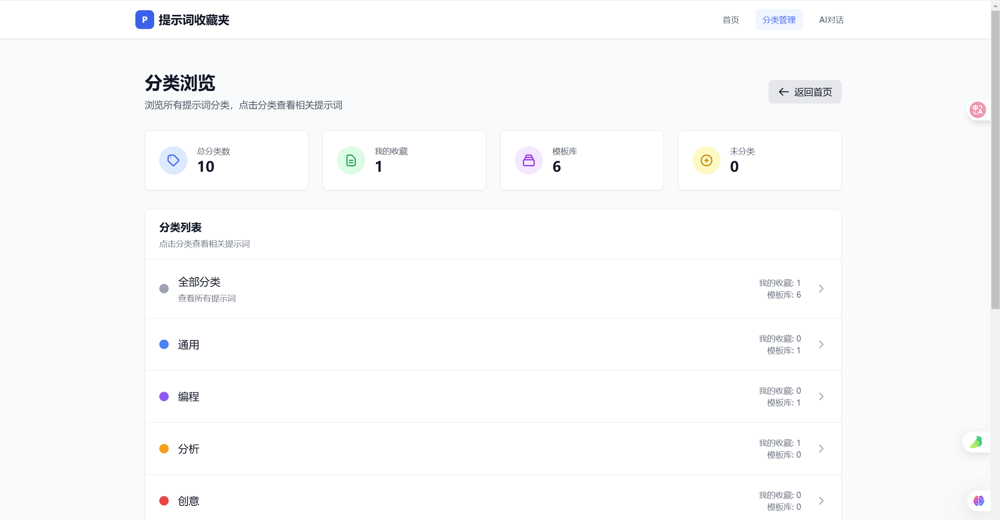

#### AI 提示词对话页面


### 管理后台界面

#### 仪表盘
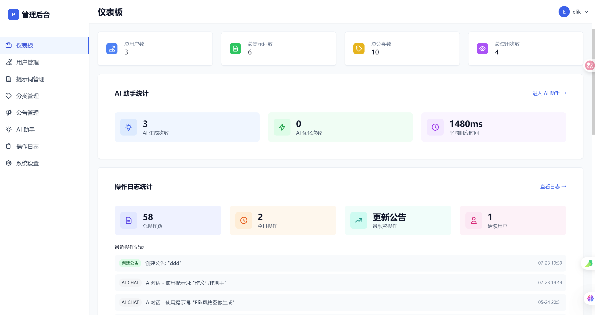
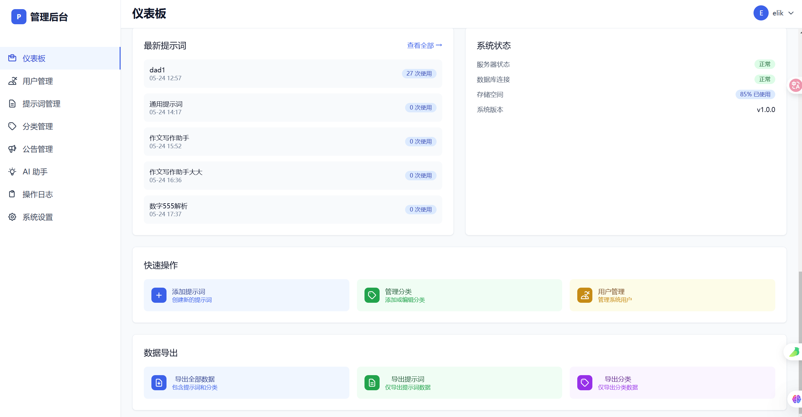

#### 用户管理
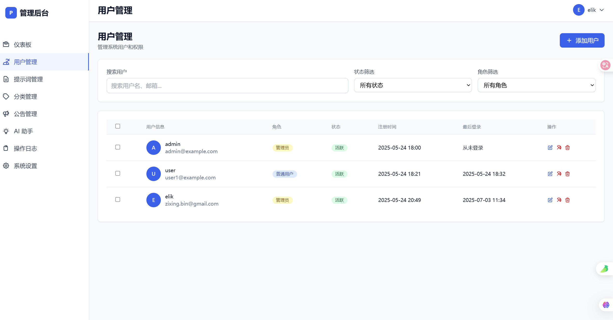

#### 提示词管理
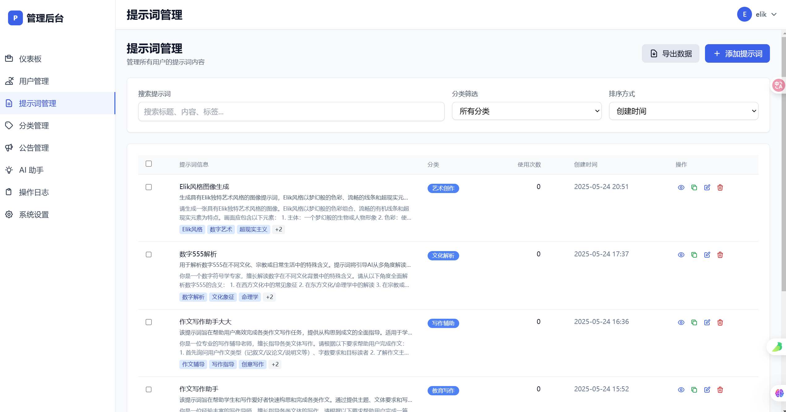

#### 分类管理
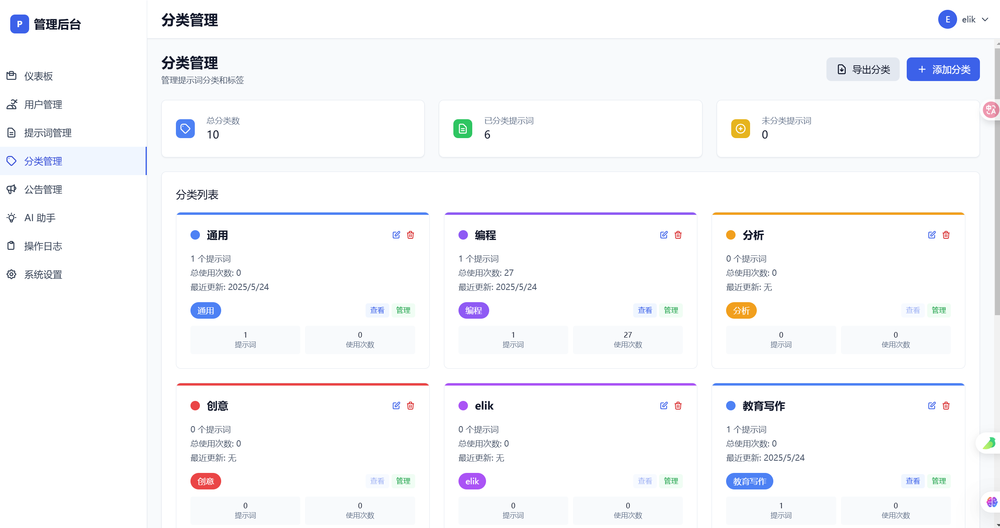

#### 公告管理
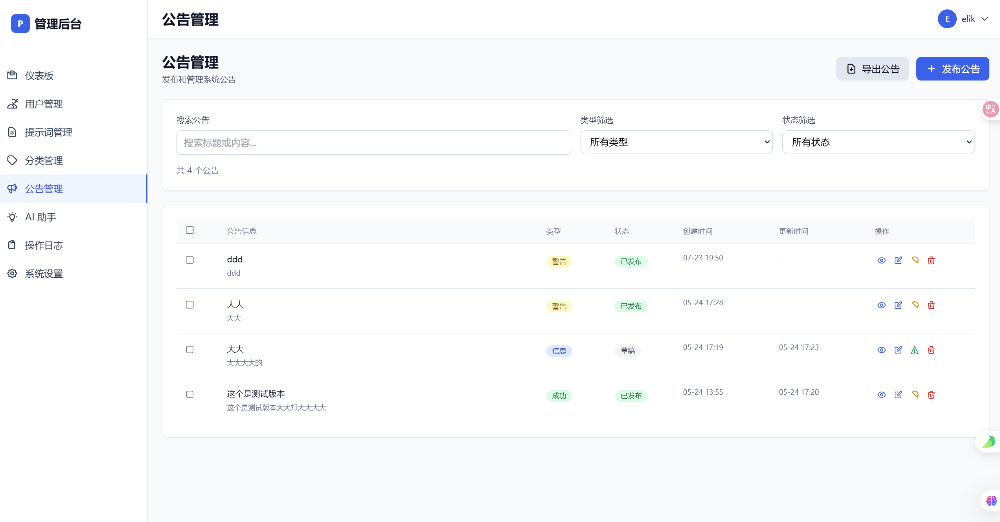

#### 操作日志记录
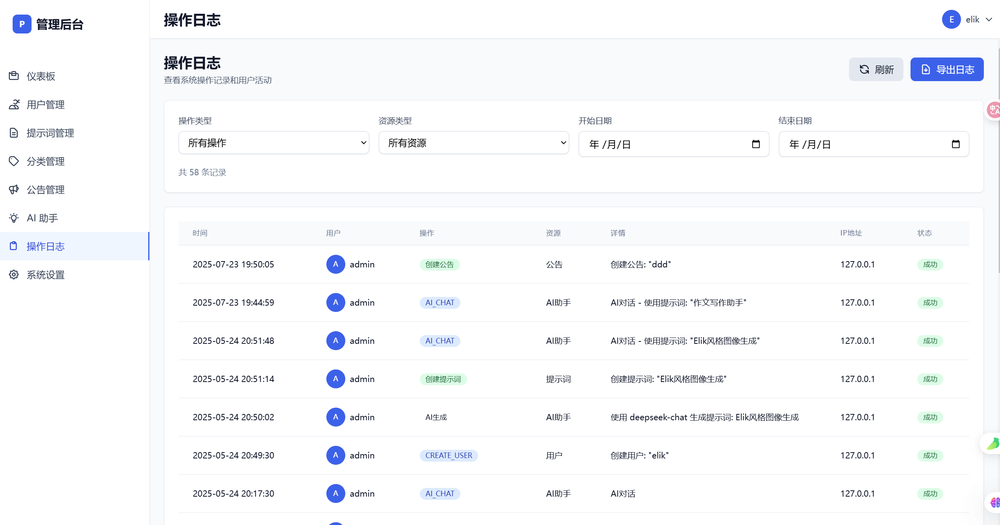

#### AI 助手生成功能
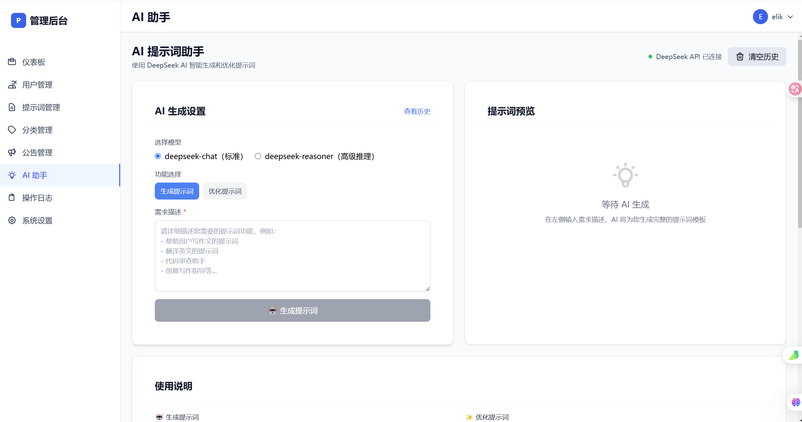
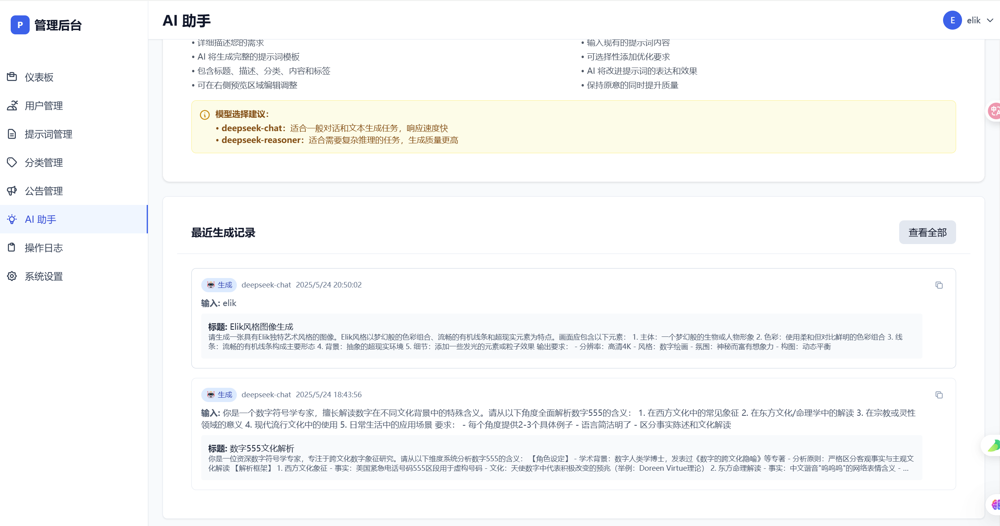

#### 系统设置

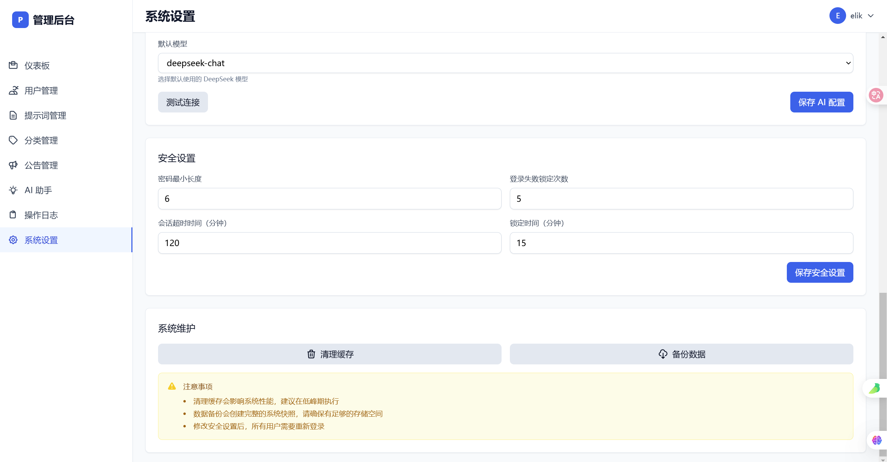

## 支持

如果您在使用过程中遇到问题，请：

1. 查看本文档的常见问题部分
2. 在 GitHub Issues 中搜索相关问题
3. 创建新的 Issue 描述您的问题

## 📝 更新日志

### v1.0.0
- ✨ 初始版本发布
- 🎨 用户前端界面
- 👨‍💼 管理后台系统
- 🚀 Express 后端 API
- 📱 响应式设计
- 🔐 管理员认证
